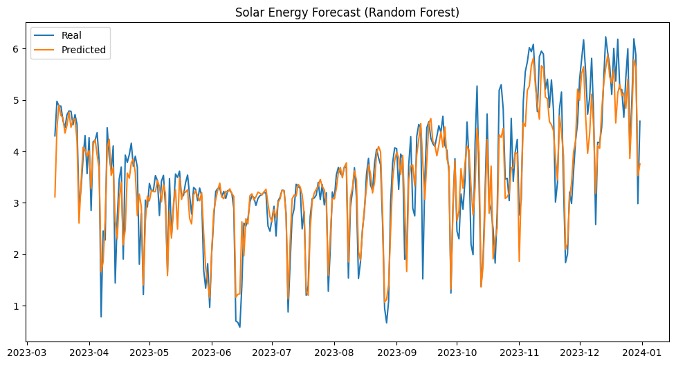
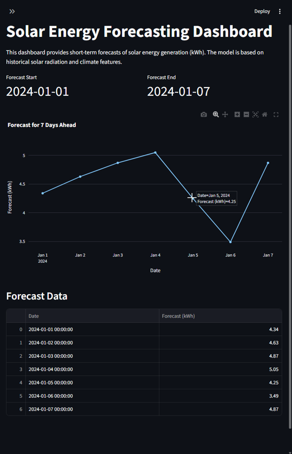
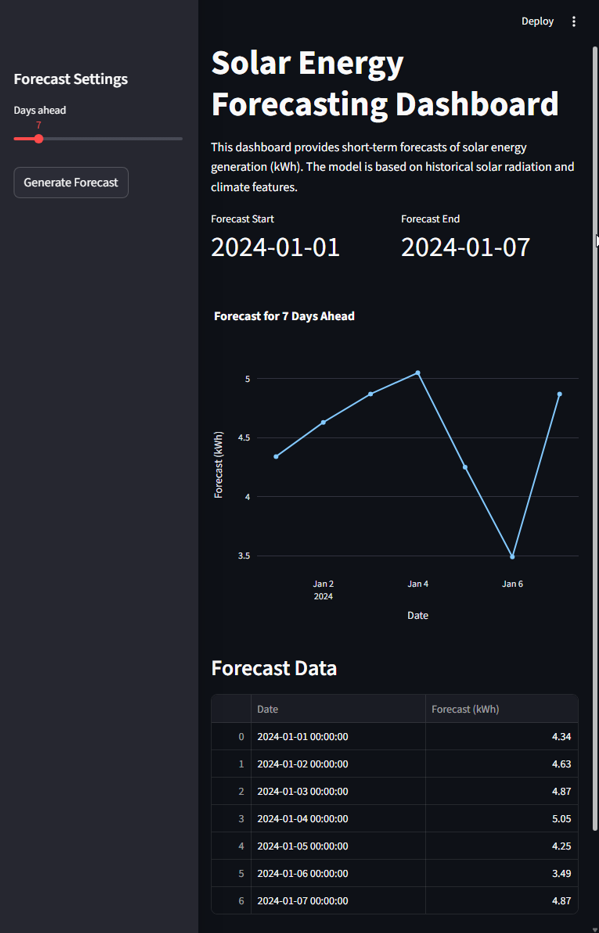

# ☀️ Solar Energy Forecast

Este projeto tem como objetivo desenvolver um sistema completo de **previsão de geração de energia solar (kWh)** utilizando dados históricos de radiação solar e variáveis climáticas (temperatura, cobertura de nuvens e precipitação).  
A solução combina **ciência de dados, machine learning e deploy em ambiente conteinerizado** para disponibilizar previsões via **API REST** e **dashboard interativo**.

---

##  Motivação

O crescimento do uso de energias renováveis, em especial a **energia solar**, torna essencial a criação de modelos preditivos que auxiliem na **tomada de decisão, planejamento de consumo e gestão de recursos energéticos**.  

Este projeto demonstra como aplicar técnicas de **Machine Learning** para criar uma aplicação prática e reprodutível de previsão energética.

---

##  Tecnologias Utilizadas

- **Linguagens e Bibliotecas**
  - Python, Pandas, NumPy, Matplotlib, Seaborn
  - Scikit-Learn (Random Forest, StandardScaler)
  - Joblib (persistência do modelo)

- **Frameworks e Ferramentas**
  - FastAPI (API REST)
  - Streamlit (Dashboard interativo)
  - Docker (containerização)

- **Outros**
  - Jupyter Notebook (EDA e treino do modelo)
  - Open-Meteo API (dados climáticos históricos)

---

##  Etapas do Projeto

1. **Coleta de Dados**
   - Download de séries históricas de radiação solar e clima (temperatura, cobertura de nuvens, precipitação).
   - Integração dos dados em um dataset único.

2. **Análise Exploratória (EDA)**
   - Visualização das séries temporais.
   - Identificação de padrões sazonais.
   - Tratamento de valores ausentes e outliers.

3. **Engenharia de Features**
   - Criação de variáveis sazonais: `dayofyear`, `month`.
   - Criação de variáveis climáticas: `temperature`, `cloudcover`, `precipitation`.
   - Criação de variáveis defasadas: `lag_1`.

4. **Treinamento do Modelo**
   - Split em treino e teste.
   - Normalização com StandardScaler.
   - Treinamento com Random Forest Regressor.
   - Avaliação (MAE, RMSE, R²).

5. **Deploy**
   - API REST em FastAPI (`/predict_solar?days=N`).
   - Dashboard em Streamlit com gráficos e tabelas interativas.
   - Containerização completa com Docker.

# Dados do Projeto

Os datasets não são enviados para o repositório.  
Para rodar o projeto, baixe os dados de radiação solar e clima via API Open-Meteo ou utilize datasets públicos de energia solar.  

Exemplo de chamada já está implementada no notebook `notebooks/eda.ipynb`.

---

## Previsão pelo modelo Random Forest

Comparação entre valores reais e previstos pelo modelo Random Forest:

### Dashboard no Streamlit

